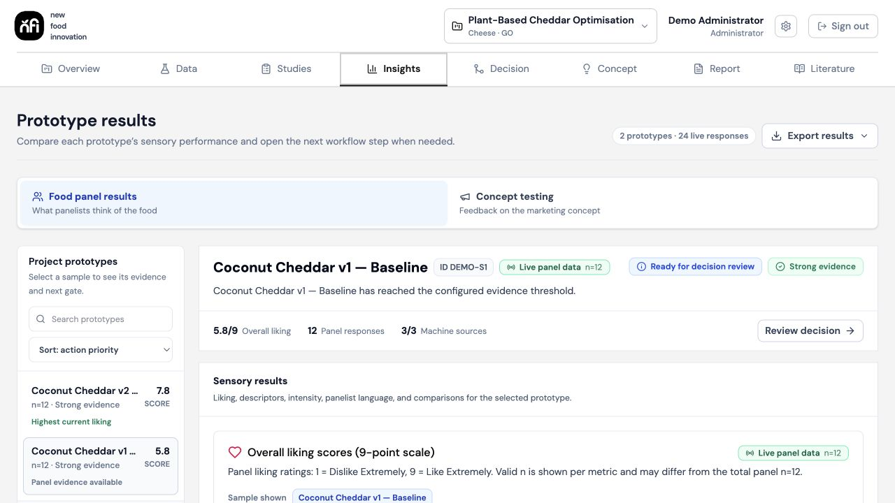
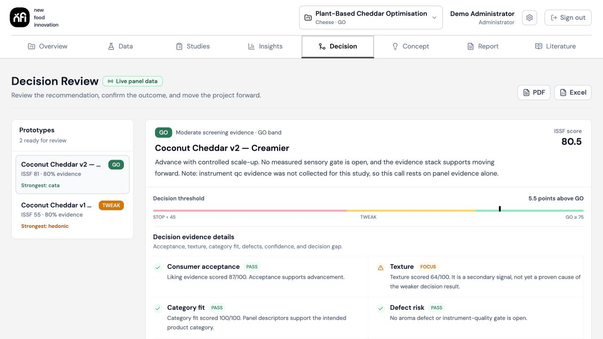
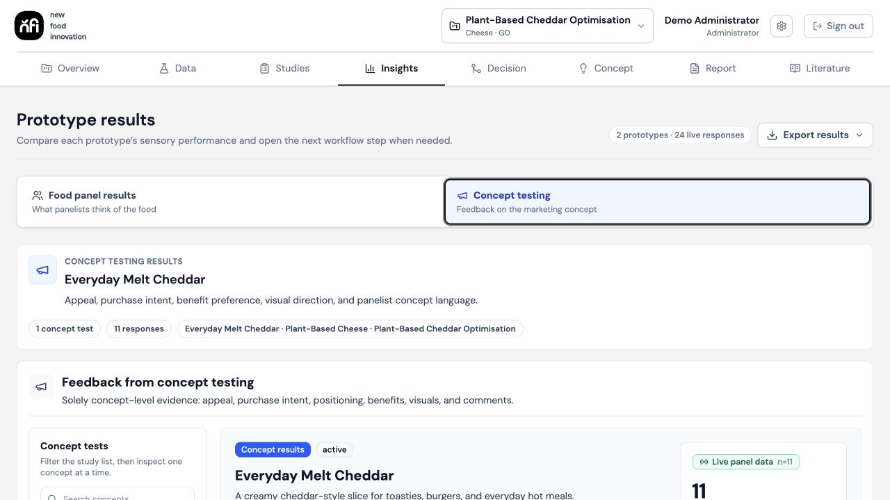
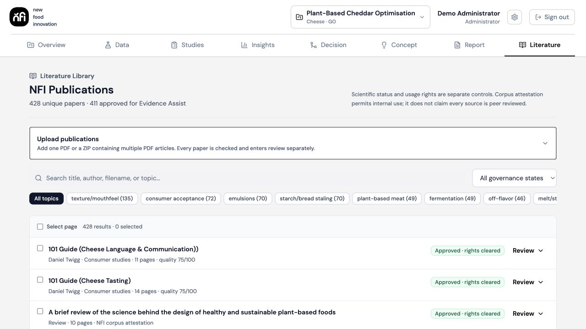

# Sensory Platform

[](https://github.com/josiahdegrasse-cloud/Sensory-Platform/actions/workflows/ci.yml)

Sensory Platform connects food-product evidence, research operations, decisions,
concept validation, and commercialization reporting in one project workspace.

**Data → Studies → Responses → Insights → Decision → Concept → Report**

[Open the live demo](https://sensory-platform.vercel.app) ·
[Use the demo accounts](DEMO_INSTRUCTIONS.md)

<p align="center">
  
</p>

<p align="center"><sub>Live panel evidence, prototype comparison, and decision readiness in one project workspace.</sub></p>

## The product

Food-product evidence is often split across instrument exports, survey tools,
spreadsheets, and presentation decks. Sensory Platform keeps that evidence tied
to a stable project and answers three practical questions:

- What evidence belongs to this formulation?
- Is it ready to move forward?
- What should the team do next?

Each project retains its imports, studies, panel responses, analysis, confirmed
decisions, concepts, and report versions. Recommendations remain traceable to
the evidence and limitations behind them.

## Workflow

| Stage | What happens |
| --- | --- |
| **Data** | Import and validate E-Tongue, GC-MS, composition, and other instrumental datasets while preserving batch and sample lineage. |
| **Studies** | Configure sensory or discrimination studies, verify sample safety, assign eligible panelists, preview, and launch. |
| **Responses** | Collect focused tasting and concept feedback with consent, progress protection, and duplicate-submission controls. |
| **Insights** | Compare sensory and instrumental results with sample sizes, evidence status, and provenance. |
| **Decision** | Calculate an explainable ISSF result and confirm a GO, TWEAK, or STOP decision. |
| **Concept** | Turn confirmed GO products into evidence-derived concepts and targeted validation studies. |
| **Report** | Assemble evidence, decisions, concept results, risks, and next actions into a branded, versioned commercialization report. |

## Product in action

<table>
  <tr>
    <td width="50%"></td>
    <td width="50%"></td>
  </tr>
  <tr>
    <td><strong>Explainable decisions.</strong> Review GO, TWEAK, and STOP recommendations against the score, threshold, confidence, and underlying evidence.</td>
    <td><strong>Connected concept validation.</strong> Carry a confirmed product decision into positioning, appeal, purchase intent, and next-step research.</td>
  </tr>
</table>

## Key capabilities

- One canonical project identity across imports, formulations, studies,
  decisions, concepts, and reports.
- Instrumental CSV and workbook import with mapping, validation, and source
  lineage.
- Single-sample, multi-sample, calibration, and blinded triangle studies.
- Allergen-aware panel assignment, panelist box passes, QR entry, and mobile
  survey flows.
- Sensory and instrumental comparison views with deterministic ISSF scoring.
- Confirmed, versioned GO/TWEAK/STOP decisions that govern downstream work.
- GO-gated concept validation with governed images and survey evidence.
- Evidence Assist for approved scientific context and controlled report claims.
- On-device Llama report writing, deterministic quality checks, administrator
  approval, and PDF/Excel exports.
- Organization-scoped data, branding, settings, audit history, and role-based
  access enforced with Supabase Row Level Security.

## AI and evidence controls

AI works inside explicit product boundaries:

1. Canonical project records and approved evidence remain the source of truth.
2. Deterministic code calculates scores, validates contracts, enforces workflow
   gates, and checks report output.
3. Evidence Assist rejects unapproved, rights-unclear, mismatched, or unsafe
   literature before it can influence report prose.
4. Commercialization-report prose is generated locally in a compatible browser
   from a bounded evidence packet; incomplete output is not saved.
5. Administrators review important outputs before they become panelist- or
   client-facing.

<p align="center">
  
</p>

<p align="center"><sub>The governed literature library separates scientific status, usage rights, relevance, and approval before sources reach Evidence Assist.</sub></p>

## Architecture

| Layer | Technology |
| --- | --- |
| Frontend | React 18, TypeScript, Vite, React Router, TanStack Query, Tailwind CSS, and Radix UI |
| Data | Supabase Postgres, Auth, Storage, Edge Functions, and Row Level Security |
| Research | Authenticated literature retrieval and Evidence Assist |
| Local inference | WebLLM with quantized Llama 3.2 models |
| Operations | Vercel, Sentry, audit trails, dependency monitoring, bundle budgets, and schema-drift checks |

## Local development

Requirements:

- Node.js 22.13–24
- pnpm 10
- A Supabase project

```bash
corepack enable
pnpm install
pnpm dev
```

Before starting the app, create an untracked `.env` file with the browser
configuration for your Supabase project:

| Variable | Purpose |
| --- | --- |
| `VITE_SUPABASE_URL` | Supabase project URL |
| `VITE_SUPABASE_ANON_KEY` | Public browser key; Row Level Security remains the authorization boundary |

Additional tenant, research, monitoring, and server settings are documented in
the [operations runbook](docs/operations-runbook.md). Never expose service-role
or provider secrets through `VITE_*` variables.

## Verification

```bash
pnpm check:runtime
pnpm typecheck
pnpm lint
pnpm test
pnpm build
```

Authorization, migration, coverage, and browser checks are available through
`test:rls:local`, `test:migration-drift`, `test:coverage`, and `test:e2e`.

## Documentation

- [Demo guide](DEMO_INSTRUCTIONS.md)
- [Product principles](PRODUCT.md)
- [Design contract](DESIGN.md)
- [Evidence Assist](docs/evidence-assist.md)
- [AI operations and governance](docs/ai-operations-governance.md)
- [Local report writing](docs/local-llama-report-writing.md)
- [Study fielding workflow](docs/study-fielding-workflow.md)
- [Operations runbook](docs/operations-runbook.md)
- [Contributing](CONTRIBUTING.md)
- [Security policy](SECURITY.md)
